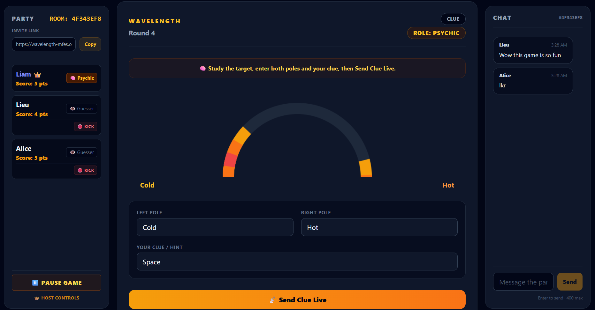
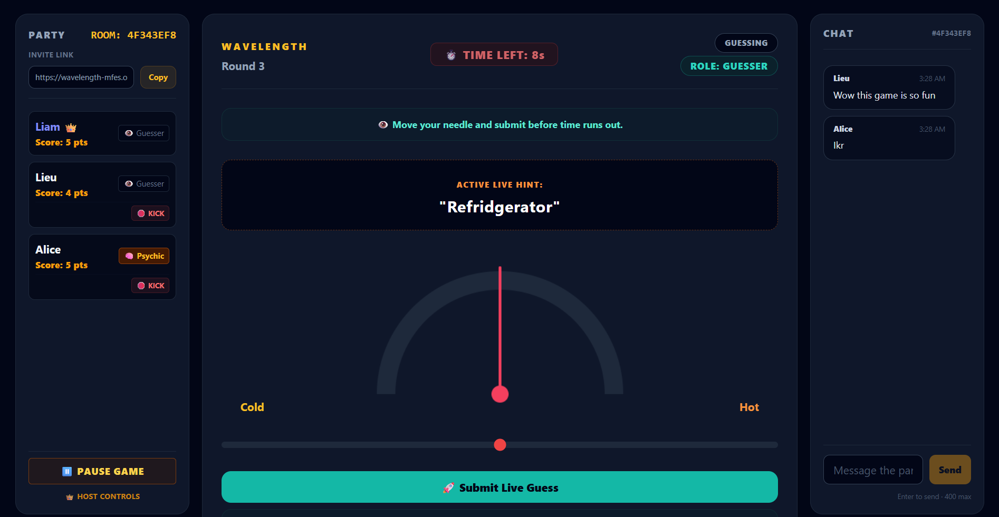
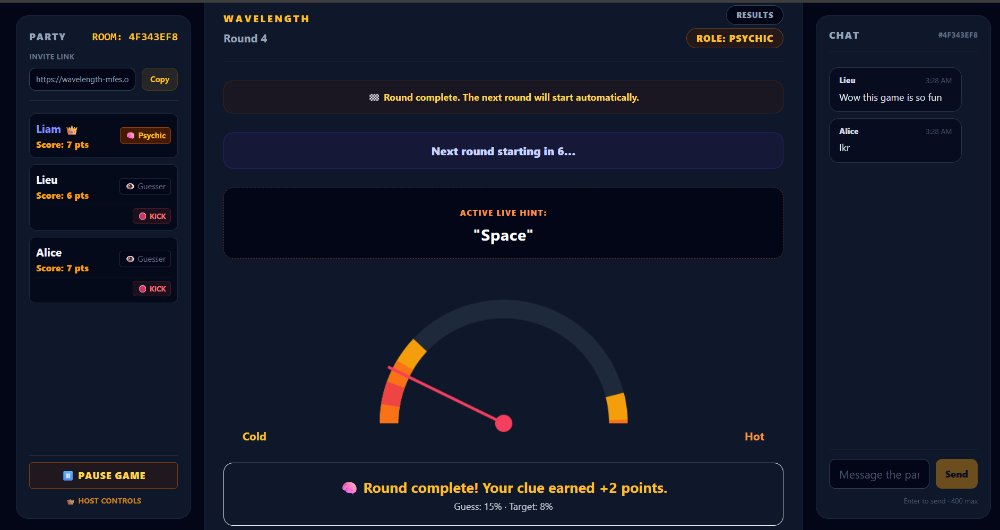

# Wavelength

Wavelength is a realtime multiplayer browser party game that friends can play online through shareable room links. An HTML5 and vanilla JavaScript client synchronizes gameplay, presence, and chat with Ably Realtime, while a small Node.js server securely issues short-lived, room-scoped Ably tokens.

**[Play the live demo](https://wavelength-mfes.onrender.com/)**

The demo runs on Render Free and may need a short cold-start wait after inactivity.

## Demo

### 1. Psychic View



The Psychic can see the hidden target and set both spectrum poles and the live clue. The Party, Game, and Chat layout remains visible, while the Psychic correctly has no adjustable guessing needle.

### 2. Guesser View



The target stays hidden from Guessers while the live clue, synchronized countdown, adjustable needle, Party status, and realtime Chat remain available.

### 3. Round Results



The reveal shows the target and guess with tiered scoring feedback. This example also shows scoring bands wrapping across the 0/100 seam, persistent party scores, and the automatic next-round countdown.

## Key Features

- Shareable realtime multiplayer rooms with short invite links
- Centered **Party | Game | Chat** desktop layout and game-first responsive mobile layout
- Authenticated, room-scoped realtime chat with safe DOM rendering and lightweight spam protection
- Host-controlled Start Game, configurable guessing and between-round timers, Pause/Resume, and kick controls
- Random or manually selected starting Psychic with a synchronized roulette and settled-result hold
- Automatic Psychic rotation, target-spin animation, and automatic round progression
- Role-specific interfaces: Psychic target/clue controls and Guesser-only dial controls
- Live clue publishing with **Send Clue Live**
- Early reveal after all eligible Guessers lock their round-scoped guesses
- Full-domain 0–100 targets with circular distance scoring and visual bands that wrap across the seam
- Participant snapshots, late-join spectator handling, reconnect grace, reload recovery, and deterministic Host failover
- Persistent scores for the current game session and tiered round-result feedback

## How It Works

The browser creates or joins a room from the current URL and stores a cryptographically random client identity in `sessionStorage`. It requests a short-lived token from `/api/ably-token`; the Node.js server signs that request with the server-only `ABLY_API_KEY` and limits the resulting capability to publish, subscribe, and presence operations for the selected room channel.

Ably Realtime coordinates authenticated client identities, room presence, chat, and explicit synchronized phases: waiting, Psychic selection, target setup, clue entry, guessing, reveal, and results. Participant snapshots keep mid-round joins from changing the active round, while reconnect grace and deterministic rotation handle temporary departures without stalling normal play.

The HTML5 Canvas API draws the spectrum, target bands, target-spin animation, and role-appropriate needle. Scoring uses the shortest circular distance, so positions near 0 and 100 are neighbors and the rendered bands agree with the awarded score across the seam.

## Technology

- HTML5, CSS, and vanilla JavaScript
- Canvas 2D rendering
- Ably Realtime JavaScript and Node.js SDKs
- Authenticated Ably client identities, presence, and room-scoped pub/sub
- Node.js built-in HTTP server for static files and secure token requests
- Tailwind CSS CDN for the current interface styling
- Node.js regression suite using `node:assert` and `node:vm`

## Testing

Install dependencies and run the reproducible regression checks:

```text
npm ci
npm test
npm run check
```

The suite covers circular-scoring edge cases, visual/scoring-band agreement, round and pause-transition races, Psychic rotation, role and settings synchronization, chat validation, deployment origins, DOM references, and authentication/security invariants. Reload, late-join, disconnect, responsive-layout, and multi-browser gameplay behavior have also been exercised manually.

## Running Locally

Prerequisites: Node.js 24.10–24.x and npm.

1. Install dependencies with `npm ci`.
2. Copy `.env.example` to `.env`.
3. Replace the placeholder `ABLY_API_KEY` with your own Ably API key. Keep `.env` local; it is ignored by Git.
4. Optionally keep `APP_ORIGIN=http://localhost:8000` for the default local server.
5. Run `npm start` and open `http://localhost:8000/`.

The server refuses to start without `ABLY_API_KEY` and never serves `.env` files as static content.

## Deployment

The live demo is deployed as a Render Web Service at [wavelength-mfes.onrender.com](https://wavelength-mfes.onrender.com/). Room codes remain temporary, so links should use the base URL unless inviting players to an active room.

To deploy a clone on Render:

1. Create a Node Web Service from the repository.
2. Use `npm ci` as the Build Command.
3. Use `npm run start` as the Start Command.
4. Add `ABLY_API_KEY` through Render's Environment settings; never commit it.
5. Leave `PORT` and `RENDER_EXTERNAL_URL` unset because Render supplies both automatically.
6. Set `APP_ORIGIN` only when a custom domain should override the generated Render origin.

The server binds to `0.0.0.0` and uses Render's assigned `PORT`. Production origin validation prefers an explicit `APP_ORIGIN`, otherwise uses the validated `RENDER_EXTERNAL_URL`, and retains a matching localhost origin for development.

## Security and Limitations

- Gameplay authority, scoring, timers, Host election, and moderation are browser-coordinated rather than enforced by a trusted game backend.
- Chat is authenticated to an Ably client identity but remains ephemeral; it has no durable history or server-enforced moderation.
- Hidden targets are omitted from ordinary public round state until reveal, but a modified Psychic client can still inspect or alter its own local runtime.
- Reload recovery is session-scoped. If every player disconnects simultaneously, no durable server snapshot remains.
- Render Free can cold-start after inactivity.
- The Tailwind CDN works for this portfolio deployment but emits its standard production-use warning. A higher-scale production version should compile and self-host its CSS, pin external assets, and add a reviewed Content Security Policy.

## AI-Assisted Development Disclosure

This project was developed in part with Google Gemini assistance. I directed the product and game behavior, tested the game, evaluated results, and iterated on the implementation.
